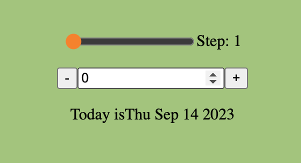

# **Challenge #3&4 - Date Counter**

This small project is the combination of the second set of challenges in "The Ultimate React Course 2023: React, Redux & More" by Jonas Schmedtmann. 

## **1. Practiced Skills**

The goal of the challenge was to solidify my understanding of state, in particular with regard to the three key steps of:
- Creating a state variable and a related function to update it.
- Using the state variable's value.
- Updating the state variable's value.